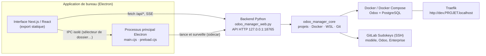

# SDK Local Manager — Odoo Manager

Dépôt : [BenjaminPeronne/SDK-Local-Manager](https://github.com/BenjaminPeronne/SDK-Local-Manager)

Application de bureau Sudokeys pour gérer les environnements **Odoo locaux** sous Docker : créer un projet, le démarrer, gérer ses bases et ses modules, sans passer par le terminal.

Elle fonctionne sous **macOS**, **Windows 10/11** (Docker Desktop, avec WSL 2 appelé automatiquement quand il le faut) et **Linux**.

---

## Sommaire

- [Fonctionnalités](#fonctionnalités)
- [Architecture](#architecture)
- [Technologies utilisées](#technologies-utilisées)
- [Structure du dépôt](#structure-du-dépôt)
- [Prérequis](#prérequis)
- [Démarrage](#démarrage)
- [Configuration et fichiers locaux](#configuration-et-fichiers-locaux)
- [Organisation d'un projet Odoo](#organisation-dun-projet-odoo)
- [Tests](#tests)
- [Compilation et publication](#compilation-et-publication)
- [Dépannage](#dépannage)
- [Documentation complémentaire](#documentation-complémentaire)

---

## Fonctionnalités

**Premier lancement**
- Assistant de vérification : dossier des projets, Docker, Git, clé SSH et Traefik.
- Sous Windows : installation de Git via `winget`, génération d'une clé SSH Ed25519 et ouverture de la page GitLab pour y déposer la clé publique. La clé privée ne quitte jamais le poste.
- Installation de Traefik (`docker-local-tools`) sans terminal.

**Projets**
- Création d'un projet Odoo **standard**, **standard + dépôt d'addons GitLab**, ou **copie d'une instance RIKA** (version Odoo détectée automatiquement).
- Préparation dans un dossier temporaire puis déplacement en une seule opération : un clone interrompu ne laisse pas de projet à moitié créé.
- Démarrage, arrêt, logs en direct, diagnostic et ouverture d'Odoo dans le navigateur une fois Traefik prêt.
- Suppression réversible : le projet est déplacé dans `.odoo_manager_deleted/`.

**Bases de données**
- Création d'une base vide ou restauration d'une sauvegarde ZIP Odoo (envoi en flux, avec progression).
- Neutralisation contrôlée des copies : crons métier et serveurs de messagerie désactivés, puis vérification dans PostgreSQL.
- Console `psql` ouverte à la demande dans le conteneur, sans exposer de port SQL.

**Modules**
- Recherche, filtres et sélection multiple.
- Installation, mise à jour ciblée ou complète (`-u all`) et installation d'un « socle » d'applications (Ventes, CRM, Comptabilité française…).
- Import de modules par ZIP ou par dépôt Git HTTPS, avec sauvegarde des versions remplacées.
- Liens symboliques Odoo Enterprise créés et vérifiés automatiquement.
- Gestion des modules absents d'une copie locale, sans désinstaller ni supprimer de données.

**Suivi**
- Historique des tâches, progression en temps réel (SSE) et journal des erreurs consultable dans l'application.

---

## Architecture



- Le **backend Python** porte toute la logique métier. Il est embarqué dans l'application sous forme d'exécutable PyInstaller (« sidecar ») et n'écoute que sur `127.0.0.1`.
- L'**interface** est une application Next.js exportée en fichiers statiques, chargée par Electron. Elle n'a pas accès à Node.js : les rares fonctions natives passent par un `preload` isolé.
- En développement, Next.js tourne en serveur et redirige `/api/*` vers le backend.

---

## Technologies utilisées

### Interface utilisateur

| Technologie | Version | Utilité |
| --- | --- | --- |
| **Next.js** | 16.3 | Framework React. Sert l'interface en développement et produit l'export statique embarqué dans Electron (`ELECTRON_BUILD=1`). |
| **React** | 19.2 | Construction de l'interface (projets, bases, modules, tâches, paramètres). |
| **TypeScript** | 5.7 | Typage du frontend et des échanges avec l'API. |
| **Radix UI Themes** | 3.3 | Composants accessibles (dialogues, onglets, sélecteurs, cases à cocher) utilisés dans `components/ui`. |
| **Tailwind CSS** | 3.4 | Mise en page et styles utilitaires. |
| **PostCSS / Autoprefixer** | 8.4 / 10.4 | Compilation de Tailwind et préfixes CSS navigateurs. |
| **clsx + tailwind-merge** | 2.x | Combinaison des classes CSS sans doublons ni conflits (`lib/utils.ts`). |
| **lucide-react** | 0.468 | Icônes de l'interface. |
| **next-themes** | 0.4 | Thème clair / sombre (sombre par défaut) et mémorisation du choix. |
| **Manrope / JetBrains Mono** | — | Polices embarquées (licence OFL) pour fonctionner hors ligne. |

### Application de bureau

| Technologie | Version | Utilité |
| --- | --- | --- |
| **Electron** | 44.3 | Fenêtre native macOS / Windows / Linux. Lance le backend sur un port libre, surveille son état et expose quelques API natives via un `preload` isolé. |
| **electron-builder** | 26.15 | Génère les installateurs : `.dmg` (macOS), `.exe` NSIS (Windows), `.deb` et `.AppImage` (Linux). |
| **cross-env** | 10.1 | Variables d'environnement des scripts npm, identiques sur toutes les plateformes. |
| **Node.js** | 22 | Outillage de build et tests Electron (`node --test`). |

### Backend

| Technologie | Version | Utilité |
| --- | --- | --- |
| **Python** | 3.12 | Backend et logique métier, **bibliothèque standard uniquement** (aucune dépendance pip à l'exécution). |
| `http.server` (`ThreadingHTTPServer`) | stdlib | API REST locale et flux temps réel SSE (`/api/stream`). |
| `subprocess`, `threading`, `queue` | stdlib | Exécution des commandes Docker, Git et WSL et file des tâches en arrière-plan. |
| `zipfile`, `shutil`, `tempfile` | stdlib | Imports ZIP contrôlés, sauvegardes et restaurations, préparation atomique des projets. |
| `urllib`, `http.cookiejar` | stdlib | Téléchargement des copies RIKA et appels HTTP vers Odoo (restauration de base). |
| **PyInstaller** | — | Transforme le backend en exécutable autonome embarqué dans l'application (aucun Python requis chez l'utilisateur). |
| **unittest** | stdlib | Tests du backend. |

### Outils pilotés par le gestionnaire

| Outil | Utilité |
| --- | --- |
| **Docker / Docker Compose** | Exécution des conteneurs Odoo et PostgreSQL de chaque projet. |
| **Docker Desktop** | Moteur Docker sous macOS et Windows ; le gestionnaire peut le lancer. |
| **Traefik** | Reverse proxy local : chaque projet est accessible via `http://dev.PROJET.localhost/`. |
| **PostgreSQL** | Base de données des instances Odoo (dans les conteneurs, aucun port exposé). |
| **Odoo Community / Enterprise** | Code source récupéré depuis GitLab pour chaque projet. |
| **Git + SSH** | Clonage du modèle Docker, d'Odoo, d'Enterprise et des dépôts d'addons (`gitlab.sudokeys.com:10022`). |
| **WSL 2** (Windows) | Création groupée des liens symboliques d'addons, Git quand il n'existe que dans WSL, et workspaces situés dans une distribution Linux. |
| **winget** (Windows) | Installation silencieuse de Git au premier lancement. |
| **RIKA** | Source des copies d'instances clientes à importer. |

### Intégration continue

| Technologie | Utilité |
| --- | --- |
| **GitHub Actions** | Compile nativement macOS (`macos-15`), Linux (`ubuntu-22.04`) et Windows, lance les tests et des tests de démarrage de l'application installée. |
| **Scripts shell / Python** (`scripts/`) | Build local, numérotation des versions, tag de build, tests de fumée et autorisation des builds macOS privés. |

---

## Structure du dépôt

```text
SDK-Local-Manager/
├── odoo_manager_web.py          # Backend : API HTTP, tâches, projets, bases, modules
├── odoo_manager_runtime.py      # Initialisation des flux et journaux du backend empaqueté
├── odoo_manager_core/           # Logique métier réutilisable
│   ├── config.py                #   Paramètres persistants (ManagerSettings, SettingsStore)
│   ├── platform.py              #   Détection OS, chemins et commandes WSL, terminaux
│   ├── project_creator.py       #   Création de projets (Git, Enterprise, RIKA, liens)
│   ├── project_service.py       #   Docker Compose, commandes Odoo, processus actifs
│   └── system.py                #   État de Docker et choix du moteur (natif ou WSL)
├── odoo-manager-next/           # Frontend et application de bureau
│   ├── app/                     #   Pages Next.js (page.tsx), styles globaux
│   ├── components/              #   Composants UI (Radix UI + Tailwind)
│   ├── lib/                     #   Pont desktop et utilitaires
│   ├── electron/                #   main.cjs, preload.cjs, runtime.cjs, icônes, tests
│   ├── public/                  #   Polices et icônes des applications Odoo
│   └── electron-builder.yml     #   Configuration des installateurs
├── scripts/                     # Build, versionnage, tests de fumée
├── tests/                       # Tests unitaires Python
├── docs/                        # Notes techniques (migration Electron, performances…)
├── odoo_manager.sh              # Ancien menu en ligne de commande (POSIX sh)
├── odoo_next_gui.sh             # Lanceur de développement (API + Next.js)
├── archive/                     # Ancienne interface Bootstrap (référence)
└── .github/workflows/           # Compilation multiplateforme
```

> `odoo-manager-next/src-tauri` et `scripts/build_tauri_sidecar.py` sont conservés à titre historique : ils ne servent plus au build depuis la migration vers Electron.

---

## Prérequis

**Pour utiliser l'application**
- Docker Desktop (macOS, Windows) ou Docker Engine avec Compose (Linux).
- Git et une clé SSH enregistrée sur GitLab Sudokeys. Sous Windows, l'assistant peut s'en charger.
- Windows : WSL 2 recommandé, avec l'intégration WSL de Docker Desktop.

**Pour développer**
- Python 3.12
- Node.js 22 et npm
- PyInstaller pour construire le backend embarqué : `python -m pip install pyinstaller`

---

## Démarrage

### Application installée

Installer le paquet correspondant au système (`.dmg`, `.exe`, `.deb` ou `.AppImage`) puis lancer **SDK Local Manager**.

### Environnement de développement

Cloner le dépôt :

```bash
git clone https://github.com/BenjaminPeronne/SDK-Local-Manager.git && cd SDK-Local-Manager
```

Installer les dépendances du frontend :

```bash
cd odoo-manager-next && npm ci
```

Lancer l'API Python et Next.js ensemble, puis ouvrir `http://127.0.0.1:3000/` :

```bash
./odoo_next_gui.sh
```

Variantes : `./odoo_next_gui.sh --background` (via tmux si disponible) et `./odoo_next_gui.sh --stop`.

Lancer seulement le backend :

```bash
python3 odoo_manager_web.py
```

Lancer seulement le frontend, en pointant vers une API déjà démarrée :

```bash
cd odoo-manager-next && ODOO_MANAGER_API=http://127.0.0.1:18765 npm run dev -- --hostname 127.0.0.1 --port 3000
```

---

## Configuration et fichiers locaux

Les paramètres se modifient dans **Paramètres** : dossier des projets, commande Docker, dossier Traefik, port de l'API, fréquence de vérification, etc.

| Élément | macOS | Windows | Linux |
| --- | --- | --- | --- |
| Configuration (`config.json`) | `~/Library/Application Support/Odoo Manager/` | `%APPDATA%\Odoo Manager\` | `~/.config/odoo-manager/` |
| Journaux du backend | `~/Library/Logs/Odoo Manager/` | `%LOCALAPPDATA%\Odoo Manager\logs\` | `~/.local/state/odoo-manager/` |

Variables d'environnement utiles :

| Variable | Rôle |
| --- | --- |
| `ODOO_MANAGER_CONFIG` / `ODOO_MANAGER_CONFIG_DIR` | Fichier ou dossier de configuration à utiliser. |
| `ODOO_MANAGER_LOG_DIR` | Dossier des journaux du backend. |
| `ODOO_GUI_HOST` / `ODOO_GUI_PORT` | Adresse et port d'écoute de l'API. |
| `ODOO_MANAGER_API` | URL de l'API utilisée par Next.js en développement. |
| `ODOO_WORKSPACE` | Dossier des projets pour l'ancien script `odoo_manager.sh`. |

Ports utilisés :

| Port | Usage |
| --- | --- |
| `18765` | API locale du gestionnaire (`127.0.0.1` uniquement). Un port libre est choisi s'il est occupé. Voir [docs/api-locale.md](docs/api-locale.md). |
| `80` / `443` | Accès aux projets via Traefik. |
| `8069` / `5432` | Odoo et PostgreSQL, internes aux conteneurs. |
| `10022` | SSH sortant vers GitLab Sudokeys. |
| `3000` | Next.js, en développement uniquement. |

---

## Organisation d'un projet Odoo

```text
Odoo-projects/
└── PROJET/
    ├── docker-compose.yml       # Modèle docker-odoo-local configuré pour le projet
    ├── odoo.conf
    └── odoo/
        ├── odoo/                # Odoo Community
        ├── addons-store/        # Sources réelles des modules
        │   ├── odoo_entreprise/ #   Odoo Enterprise
        │   └── <dépôt ou module importé>
        └── addons/              # Liens symboliques relatifs lus par Odoo
```

Les modules sont toujours **copiés dans `addons-store/`** et **exposés par un lien relatif dans `addons/`**. Un projet reste ainsi autonome et déplaçable, et le gestionnaire sait quelles entrées il peut remplacer ou supprimer sans risque.

Le master password local des bases est `odoo`.

---

## Tests

Backend Python :

```bash
python3 -m unittest discover -s tests -v
```

Frontend (vérification des types) et processus Electron :

```bash
cd odoo-manager-next && npm run typecheck && npm run test:desktop
```

---

## Compilation et publication

Build local de l'application de bureau :

```bash
cd odoo-manager-next && npm ci && npm run build:desktop && cd .. && sh scripts/build_local_desktop.sh
```

Les installateurs sont générés dans `odoo-manager-next/release/`.

Compilation des trois plateformes via GitHub Actions (tag `app-v<version>-buildN` calculé automatiquement, puis téléchargement des artefacts dans `dist/all-platforms/`) :

```bash
sh scripts/build_all_platforms.sh
```

Pour une nouvelle version fonctionnelle, synchroniser d'abord le numéro de version :

```bash
python3 scripts/set_app_version.py 0.3.1
```

Chaque runner CI lance les tests, construit le backend PyInstaller, vérifie `/api/health`, puis installe et démarre l'application empaquetée avant de publier l'installateur.

Les builds macOS privés sont signés ad hoc mais pas notarisés. Après téléchargement, retirer la quarantaine avec :

```bash
sh scripts/macos_allow_private_build.sh
```

---

## Dépannage

| Symptôme | Piste |
| --- | --- |
| « Service local indisponible » | Le backend n'a pas démarré ou le port est pris : consulter `backend.log` dans le dossier des journaux. |
| Docker signalé arrêté | Lancer Docker Desktop (bouton **Ouvrir Docker**) puis **Actualiser**. |
| Échec du clonage GitLab | Vérifier que la clé SSH publique est enregistrée sur GitLab et que le port `10022` est joignable. Sous Windows, préférer un chemin court (ex. `C:\Odoo`). |
| Liens d'addons illisibles sous Windows (`WinError 1920`), liste des modules très lente | Liens créés par WSL par une ancienne version, sans le mode développeur. Un bandeau propose **Convertir les liens** dans le projet : activer le mode développeur Windows (Paramètres > Système > Espace développeurs), arrêter le projet, puis convertir. Les liens deviennent des liens Windows relatifs, lus par Windows et par Docker ; une conversion interrompue se reprend depuis le même bandeau. |
| `Bad Gateway` à l'ouverture d'Odoo | Odoo s'initialise encore (jusqu'à plusieurs minutes sur un disque Windows) : suivre les logs du projet. |

Le journal des erreurs de l'application regroupe les erreurs de l'interface, de l'API et des tâches, avec leur trace.

---

## Documentation complémentaire

- [README_next_odoo_manager.md](README_next_odoo_manager.md) : détail des fonctionnalités de l'interface, de la restauration et de la publication.
- [README_odoo_manager.md](README_odoo_manager.md) : ancien menu en ligne de commande (`odoo_manager.sh`).
- [docs/api-locale.md](docs/api-locale.md) : API locale pour les intégrateurs — version, contrat publié, lancement et suivi des actions.
- [docs/electron-migration.md](docs/electron-migration.md) : migration de Tauri vers Electron.
- [docs/REFACTORING_CROSS_PLATFORM.md](docs/REFACTORING_CROSS_PLATFORM.md) : refonte multiplateforme.
- [docs/performance-audit-2026-09-08.md](docs/performance-audit-2026-09-08.md) : audit des performances.
- [docs/audit-performances-windows-2026-09-17.md](docs/audit-performances-windows-2026-09-17.md) : performances Windows, Docker et bind mounts WSL.
- [docs/proposition-integration-wsl-2026-09-17.md](docs/proposition-integration-wsl-2026-09-17.md) : proposition d'intégration WSL en un clic.
- [docs/recette-wsl-2026-09-18.md](docs/recette-wsl-2026-09-18.md) : recette de l'environnement WSL.
- [docs/design-responsive-qa.md](docs/design-responsive-qa.md) : contrôle du design responsive.
