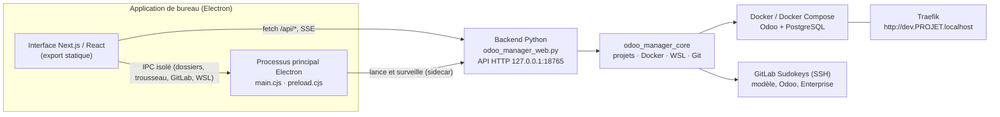

# SDK Local Manager

Dépôt : [cdp/sdk-local-manager](https://gitlab.sudokeys.com/cdp/sdk-local-manager) sur le GitLab Sudokeys.

Application de bureau Sudokeys pour gérer les environnements **Odoo locaux** sous Docker : créer un projet, le démarrer, gérer ses bases et ses modules, sans passer par le terminal.

Elle fonctionne sous **macOS**, **Linux** et **Windows 10/11**. Sous Windows, elle installe et maintient son propre environnement Linux (WSL 2) où tournent Docker, les projets et le backend.

---

## Sommaire

- [Fonctionnalités](#fonctionnalités)
- [Architecture](#architecture)
- [Technologies utilisées](#technologies-utilisées)
- [Structure du dépôt](#structure-du-dépôt)
- [Prérequis](#prérequis)
- [Démarrage](#démarrage)
- [Configuration et fichiers locaux](#configuration-et-fichiers-locaux)
- [Organisation d'un projet Odoo](#organisation-dun-projet-odoo)
- [Fonctionnement détaillé](#fonctionnement-détaillé)
- [Tests](#tests)
- [Compilation et publication](#compilation-et-publication)
- [Dépannage](#dépannage)
- [Documentation complémentaire](#documentation-complémentaire)

---

## Fonctionnalités

**Premier lancement**
- Assistant de vérification : dossier des projets, Docker, Git, clé SSH et Traefik.
- Génération d'une clé SSH Ed25519 (régénérable, l'ancienne paire est sauvegardée) et ouverture de la page GitLab pour y déposer la clé publique. La clé privée ne quitte jamais le poste.
- Installation de Traefik (`docker-local-tools`) sans terminal.
- Sous Windows : préparation du poste en un clic (WSL, puis environnement Linux « SDK-Manager » avec Docker, Git et le backend), reprise de la clé GitLab Windows, et proposition de copier les projets restés sur `C:\` dans cet environnement.

**Projets**
- Création d'un projet Odoo **standard**, **standard + dépôt d'addons GitLab**, ou **copie d'une instance RIKA** (version Odoo détectée automatiquement).
- Connexion facultative à un compte GitLab (jeton personnel) pour rechercher les dépôts et choisir la branche ou le tag au clavier.
- Préparation dans un dossier temporaire puis déplacement en une seule opération : un clone interrompu ne laisse pas de projet à moitié créé.
- Démarrage, arrêt, logs en direct, diagnostic et ouverture d'Odoo dans le navigateur une fois Traefik prêt.
- Suppression réversible : le projet est déplacé dans `.odoo_manager_deleted/`.

**Bases de données**
- Création d'une base vide, restauration d'une sauvegarde ZIP Odoo (envoi en flux, avec progression) et suppression.
- Neutralisation contrôlée des copies : crons métier et serveurs de messagerie désactivés, puis vérification dans PostgreSQL.
- Réinitialisation du mot de passe administrateur et des traductions, régénération des assets.
- Console `psql` ouverte à la demande dans le conteneur, sans exposer de port SQL.

**Modules**
- Recherche, filtres, sélection multiple et barre d'actions groupées.
- Installation, mise à jour ciblée ou complète (`-u all`) et installation d'un « socle » d'applications avec son plan de dépendances.
- Import de modules par ZIP ou depuis un dépôt Git, avec aperçu des versions, contrôles préalables et sauvegarde des versions remplacées.
- Liens symboliques Odoo Enterprise créés et vérifiés automatiquement.
- Gestion des modules absents d'une copie locale, sans désinstaller ni supprimer de données.

**Actions et suivi**
- Les actions d'un même projet sont mises en file au lieu de s'exécuter en parallèle.
- Une action en cours peut être arrêtée : ses processus sont interrompus puis ses effets défaits (conteneurs démarrés, bases partiellement créées, imports de modules). Les étapes irréversibles refusent l'arrêt.
- Historique des actions, progression en temps réel (SSE) et journal des erreurs consultable dans l'application.
- Identifiants RIKA et jeton GitLab mémorisés dans le trousseau du système.

---

## Architecture



- Le **backend Python** porte toute la logique métier. Il est embarqué dans l'application sous forme d'exécutable PyInstaller (« sidecar ») et n'écoute que sur `127.0.0.1`.
- L'**interface** est une application Next.js exportée en fichiers statiques, chargée par Electron. Elle n'a pas accès à Node.js : les fonctions natives passent par un `preload` isolé.
- **Sous Windows**, le backend tourne dans la distribution WSL « SDK-Manager », sur un système de fichiers Linux (Odoo y démarre en quelques secondes au lieu d'une minute depuis `C:\`). Si cet environnement ne démarre pas, l'application bascule sur le backend Windows avec Docker Desktop et l'indique. Voir [wsl/README.md](wsl/README.md).
- En développement, Next.js tourne en serveur et redirige `/api/*` vers le backend.

---

## Technologies utilisées

### Interface utilisateur

| Technologie | Version | Utilité |
| --- | --- | --- |
| **Next.js** | 16.3 | Framework React. Sert l'interface en développement et produit l'export statique embarqué dans Electron (`ELECTRON_BUILD=1`). |
| **React** | 19.2 | Construction de l'interface (projets, bases, modules, actions, paramètres). |
| **TypeScript** | 5.9 | Typage du frontend et des échanges avec l'API. |
| **Radix UI Themes** | 3.3 | Composants accessibles (dialogues, onglets, sélecteurs, cases à cocher) utilisés dans `components/ui`. |
| **Tailwind CSS** | 3.4 | Mise en page et styles utilitaires. |
| **PostCSS / Autoprefixer** | 8.4 / 10.4 | Compilation de Tailwind et préfixes CSS navigateurs. |
| **clsx + tailwind-merge** | 2.x | Combinaison des classes CSS sans doublons ni conflits (`lib/utils.ts`). |
| **lucide-react** | 0.468 | Icônes de l'interface. |
| **next-themes** | 0.4 | Thème clair / sombre (sombre par défaut) et mémorisation du choix. |
| **Manrope / JetBrains Mono** | — | Polices embarquées (licence OFL) pour fonctionner hors ligne. |

### Application de bureau

| Technologie | Version | Utilité |
| --- | --- | --- |
| **Electron** | 44.3 | Fenêtre native macOS / Windows / Linux. Lance le backend sur un port libre, surveille son état et expose les API natives via un `preload` isolé. |
| **electron-builder** | 26.15 | Génère les installateurs : `.dmg` (macOS), `.exe` NSIS (Windows), `.deb` et `.AppImage` (Linux). |
| **cross-env** | 10.1 | Variables d'environnement des scripts npm, identiques sur toutes les plateformes. |
| **Node.js** | 22 | Outillage de build et tests Electron (`node --test`). |

### Backend

| Technologie | Version | Utilité |
| --- | --- | --- |
| **Python** | 3.12 | Backend et logique métier, **bibliothèque standard uniquement** (aucune dépendance pip à l'exécution). |
| `http.server` (`ThreadingHTTPServer`) | stdlib | API REST locale et flux temps réel SSE (`/api/stream`). |
| `subprocess`, `threading`, `queue` | stdlib | Exécution des commandes Docker, Git et WSL et file des actions en arrière-plan. |
| `zipfile`, `shutil`, `tempfile` | stdlib | Imports ZIP contrôlés, sauvegardes et restaurations, préparation atomique des projets. |
| `urllib`, `http.cookiejar` | stdlib | Téléchargement des copies RIKA et appels HTTP vers Odoo (restauration de base). |
| **PyInstaller** | — | Transforme le backend en exécutable autonome embarqué dans l'application (aucun Python requis chez l'utilisateur). |
| **unittest** | stdlib | Tests du backend. |

### Outils pilotés par le gestionnaire

| Outil | Utilité |
| --- | --- |
| **Docker / Docker Compose** | Exécution des conteneurs Odoo et PostgreSQL de chaque projet. |
| **Docker Desktop** | Moteur Docker sous macOS, et sous Windows en mode de repli ; le gestionnaire peut le lancer. |
| **WSL 2** (Windows) | Distribution « SDK-Manager » (Debian 12, Docker Engine, Git) installée et mise à jour par l'application. |
| **Traefik** | Reverse proxy local : chaque projet est accessible via `http://dev.PROJET.localhost/`. |
| **PostgreSQL** | Base de données des instances Odoo (dans les conteneurs, aucun port exposé). |
| **Odoo Community / Enterprise** | Code source récupéré depuis GitLab pour chaque projet. |
| **Git + SSH** | Clonage du modèle Docker, d'Odoo, d'Enterprise et des dépôts d'addons (`gitlab.sudokeys.com:10022`). |
| **RIKA** | Source des copies d'instances clientes à importer. |

### Intégration continue

| Technologie | Utilité |
| --- | --- |
| **GitHub Actions** | Compile nativement macOS (`macos-15`), Linux (`ubuntu-22.04`) et Windows, construit l'image WSL, lance les tests et des tests de démarrage de l'application installée. Le passage à GitLab CI reste à faire. |
| **Scripts shell / Python** (`scripts/`) | Build local, numérotation des versions, tag de build, image WSL, tests de fumée et autorisation des builds macOS privés. |

---

## Structure du dépôt

```text
SDK-Local-Manager/
├── odoo_manager_web.py          # Backend : API HTTP, actions, projets, bases, modules
├── odoo_manager_runtime.py      # Initialisation des flux et journaux du backend empaqueté
├── odoo_manager_core/           # Logique métier réutilisable
│   ├── config.py                #   Paramètres persistants (ManagerSettings, SettingsStore)
│   ├── platform.py              #   Détection OS, chemins et commandes WSL, terminaux
│   ├── project_creator.py       #   Création de projets (Git, Enterprise, RIKA, liens)
│   ├── project_service.py       #   Docker Compose, commandes Odoo, processus actifs
│   ├── jobs.py                  #   Arrêt des actions et retour arrière
│   ├── migration.py             #   Copie des projets de C:\ vers l'environnement WSL
│   ├── docker_api.py            #   État de Docker lu par l'API du moteur
│   ├── system.py                #   État de Docker et choix du moteur (natif ou WSL)
│   ├── traefik.py               #   Détection des instances Traefik et de leurs ports
│   ├── windows_links.py         #   Liens d'addons sous Windows
│   └── version.py               #   Version publiée par /api/version
├── odoo-manager-next/           # Frontend et application de bureau
│   ├── app/                     #   Page Next.js (page.tsx), styles globaux, icônes
│   ├── components/              #   Composants UI (Radix UI + Tailwind), assistant WSL, sélecteur GitLab
│   ├── lib/                     #   Pont desktop et utilitaires, avec leurs tests
│   ├── electron/                #   main.cjs, preload.cjs, runtime.cjs, wsl.cjs, gitlab.cjs, icônes, tests
│   ├── public/                  #   Polices et icônes des applications Odoo
│   └── electron-builder.yml     #   Configuration des installateurs
├── wsl/                         # Image de la distribution WSL « SDK-Manager »
├── scripts/                     # Build, versionnage, image WSL, tests de fumée
├── tests/                       # Tests unitaires Python
├── docs/                        # API locale et application Electron
├── archive/cli/                 # Ancien menu en ligne de commande, plus utilisé par l'application
├── odoo_next_gui.sh             # Lanceur de développement (API + Next.js)
└── .github/workflows/           # Compilation multiplateforme
```

---

## Prérequis

**Pour utiliser l'application**
- macOS : Docker Desktop.
- Linux : Docker Engine avec Compose.
- Windows : rien à installer au préalable. L'application active WSL (avec l'autorisation de l'utilisateur) et installe son environnement Linux ; Docker Desktop ne sert qu'en mode de repli.
- Une clé SSH enregistrée sur GitLab Sudokeys. L'assistant de premier lancement peut la générer.

**Pour développer**
- Python 3.12
- Node.js 22 et npm
- PyInstaller pour construire le backend embarqué : `python -m pip install pyinstaller`
- Docker, pour construire l'image WSL

---

## Démarrage

### Application installée

Installer le paquet correspondant au système (`.dmg`, `.exe`, `.deb` ou `.AppImage`) puis lancer **SDK Local Manager**.

### Environnement de développement

Cloner le dépôt :

```bash
git clone ssh://git@gitlab.sudokeys.com:10022/cdp/sdk-local-manager.git && cd sdk-local-manager
```

Installer les dépendances du frontend :

```bash
cd odoo-manager-next && npm ci
```

Lancer l'API Python et Next.js ensemble, puis ouvrir `http://127.0.0.1:3000/` :

```bash
./odoo_next_gui.sh
```

Variantes : `./odoo_next_gui.sh --background` (via tmux si disponible) et `./odoo_next_gui.sh --stop`.

Lancer seulement le backend :

```bash
python3 odoo_manager_web.py
```

Lancer seulement le frontend, en pointant vers une API déjà démarrée :

```bash
cd odoo-manager-next && ODOO_MANAGER_API=http://127.0.0.1:18765 npm run dev -- --hostname 127.0.0.1 --port 3000
```

---

## Configuration et fichiers locaux

Les paramètres se modifient dans **Paramètres** : dossier des projets, commande Docker, dossier Traefik, port de l'API, fréquence de vérification, etc.

| Élément | macOS | Windows | Linux |
| --- | --- | --- | --- |
| Configuration (`config.json`) | `~/Library/Application Support/Odoo Manager/` | `%APPDATA%\Odoo Manager\` | `~/.config/odoo-manager/` |
| Journaux du backend | `~/Library/Logs/Odoo Manager/` | `%LOCALAPPDATA%\Odoo Manager\logs\` | `~/.local/state/odoo-manager/` |
| Environnement Linux | — | `%LOCALAPPDATA%\SDK Local Manager\wsl` | — |

Les identifiants RIKA et le jeton GitLab sont chiffrés par le trousseau du système (Electron `safeStorage`), jamais écrits en clair dans `config.json`.

Variables d'environnement utiles :

| Variable | Rôle |
| --- | --- |
| `ODOO_MANAGER_CONFIG` / `ODOO_MANAGER_CONFIG_DIR` | Fichier ou dossier de configuration à utiliser. |
| `ODOO_MANAGER_LOG_DIR` | Dossier des journaux du backend. |
| `ODOO_GUI_HOST` / `ODOO_GUI_PORT` | Adresse et port d'écoute de l'API. |
| `ODOO_MANAGER_API` | URL de l'API utilisée par Next.js en développement. |
| `ODOO_WORKSPACE` | Dossier des projets proposé par défaut, tant qu'aucun n'est enregistré dans les paramètres. |

Ports utilisés :

| Port | Usage |
| --- | --- |
| `18765` | API locale du gestionnaire (`127.0.0.1` uniquement). Un port libre est choisi s'il est occupé. Voir [docs/api-locale.md](docs/api-locale.md). |
| `80` / `443` | Accès aux projets via Traefik. |
| `8069` / `5432` | Odoo et PostgreSQL, internes aux conteneurs. |
| `10022` | SSH sortant vers GitLab Sudokeys. |
| `3000` | Next.js, en développement uniquement. |

---

## Organisation d'un projet Odoo

```text
Odoo-projects/
└── PROJET/
    ├── docker-compose.yml       # Modèle docker-odoo-local configuré pour le projet
    ├── odoo.conf
    └── odoo/
        ├── odoo/                # Odoo Community
        ├── addons-store/        # Sources réelles des modules
        │   ├── odoo_entreprise/ #   Odoo Enterprise
        │   └── <dépôt ou module importé>
        └── addons/              # Liens symboliques relatifs lus par Odoo
```

Les modules sont toujours **copiés dans `addons-store/`** et **exposés par un lien relatif dans `addons/`**. Un projet reste ainsi autonome et déplaçable, et le gestionnaire sait quelles entrées il peut remplacer ou supprimer sans risque.

Les formulaires sont pré-remplis avec les valeurs par défaut d'Odoo : master password `odoo`, compte `admin` / `admin`. Elles peuvent être modifiées à la création d'une base.

---

## Fonctionnement détaillé

### Créer un projet

Le backend récupère le modèle Docker, Odoo Community et Odoo Enterprise depuis GitLab, configure le projet puis crée les liens relatifs des modules. Git est appelé avec des arguments structurés, sans terminal interactif ni demande d'identifiants. Quand un autre projet contient déjà le même dépôt, ses objets servent de cache local puis sont dissociés : chaque projet reste autonome.

**Copie depuis RIKA** demande le nom de l'instance et les identifiants Sudokeys, génère et télécharge la copie, contrôle le ZIP, puis détecte la version Odoo avant de préparer le modèle Docker correspondant.

### Restaurer une sauvegarde

Dans l'onglet **Bases**, **Restaurer une sauvegarde ZIP** remplace le passage par `/web/database/selector`. Le fichier est écrit progressivement sur disque puis transmis en flux au contrôleur officiel `/web/database/restore`, sans charger la sauvegarde en mémoire. Le fichier temporaire est supprimé à la fin, y compris en cas d'erreur.

La base est déclarée comme une copie et la **neutralisation** est activée par défaut. Pendant la restauration, Odoo tourne avec ses workers cron coupés ; le gestionnaire relance ensuite le moteur de neutralisation des modules installés et vérifie dans PostgreSQL que la base est marquée neutralisée, que les crons métier sont inactifs (seul l'autovacuum peut rester actif) et qu'aucun serveur de messagerie exploitable n'est actif. Odoo 16 à 19 utilisent le moteur natif ; Odoo 15 applique un repli limité aux crons et aux serveurs de messagerie. Le bouton **Neutraliser et contrôler** rejoue cette passe sur une base existante.

Une base neutralisée l'est de nouveau après chaque installation ou mise à jour de module, avant le redémarrage d'Odoo : un addon nouvellement chargé ne peut pas réactiver un cron ou une intégration externe.

### Modules absents d'une copie locale

Avant une mise à jour complète, le gestionnaire détecte les modules en état `to install`, `to upgrade` ou `to remove`, que leur code soit disponible ou non. Les modules inutiles pour la recette locale peuvent être exclus : seule leur opération en attente est annulée, sans désinstallation ni perte de données. L'exclusion est refusée si un module actif dont le code est présent en dépend.

Tant qu'une exclusion existe, la mise à jour complète utilise la liste explicite des modules installés dont le code est disponible au lieu de `-u all`. Les exclusions apparaissent dans le diagnostic et se réactivent depuis la même fenêtre.

### Ajouter des modules depuis un dépôt Git

Dans **Modules**, renseigner l'URL du dépôt et une branche ou un tag compatible avec la version Odoo, puis choisir les modules dans la liste lue en direct.

- **Ajouter** refuse un module déjà présent, avant toute modification.
- **Mettre à jour** remplace uniquement les copies gérées dans `addons-store/` et leur lien dans `addons/` ; les autres dossiers sont protégés.
- Le dépôt est récupéré dans un dossier temporaire (cinq minutes au plus). Les liens symboliques et les noms de modules ambigus sont refusés. Les dépôts privés utilisent les accès Git déjà configurés, sans jeton dans l'URL.
- Les versions remplacées sont conservées dans `.odoo_manager_backups/modules/<projet>` ; un import qui échoue ou qu'on arrête est défait.
- L'opération ne prépare que le **code** : installer ou mettre à jour ensuite les modules dans la base.

---

## Tests

Backend Python :

```bash
python3 -m unittest discover -s tests -v
```

Frontend (types et utilitaires) et processus Electron :

```bash
cd odoo-manager-next && npm run typecheck && npm run test:lib && npm run test:desktop
```

---

## Compilation et publication

### Build local

```bash
cd odoo-manager-next && npm ci && npm run build:desktop && cd .. && sh scripts/build_local_desktop.sh
```

Les installateurs sont générés dans `odoo-manager-next/release/` : `.app` et `.dmg` sur macOS, `.deb` et `.AppImage` sur Linux, `.exe` NSIS sur Windows. Un Mac ne produit pas de manière fiable les installateurs Windows et Linux : ils sont construits par la CI.

### Numéro de version

Pour une nouvelle version, synchroniser le numéro dans tous les manifestes, puis commiter :

```bash
python3 scripts/set_app_version.py 0.8.0
```

### Build des trois plateformes

```bash
sh scripts/build_all_platforms.sh
```

Le script refuse de partir si le dépôt contient des changements non commités ou si la branche n'est pas synchronisée avec `origin`. Il vérifie le backend, les tests et le build Next.js, calcule le prochain tag `app-v<version>-buildN`, le pousse, attend la fin du workflow GitHub Actions puis télécharge les installateurs dans `dist/all-platforms/<tag>/` (avec GitHub CLI authentifié). Options utiles : `--tag`, `--local`, `--no-wait`, `--no-download`.

Chaque runner reconstruit le backend de sa plateforme, le démarre et contrôle `/api/health` avant de produire l'installateur. Sous Windows, le pipeline installe silencieusement le paquet NSIS, lance l'application installée, contrôle de nouveau l'API, puis relance l'installateur pendant que l'application est ouverte pour vérifier la mise à niveau. Les artefacts sont conservés un jour : télécharger les paquets à archiver avant leur expiration.

### Builds macOS privés

Les paquets macOS sont signés ad hoc mais pas notarisés : après téléchargement, macOS peut les déclarer endommagés. Glisser l'application dans **Applications**, puis retirer la quarantaine :

```bash
sh scripts/macos_allow_private_build.sh
```

Une distribution sans alerte demandera un certificat Apple Developer ID et la notarisation du DMG ; les certificats seront injectés par les secrets de la CI, jamais commités.

---

## Dépannage

| Symptôme | Piste |
| --- | --- |
| « Service local indisponible » | Le backend n'a pas démarré ou le port est pris : consulter `backend.log` dans le dossier des journaux. |
| Docker signalé arrêté | Lancer Docker Desktop (bouton **Ouvrir Docker**) puis **Actualiser**. Sous Windows, relancer la préparation du poste si l'environnement Linux est indisponible. |
| Échec du clonage GitLab | Vérifier que la clé SSH publique est enregistrée sur GitLab et que le port `10022` est joignable. |
| Port 80 occupé sous Windows | Un ancien Traefik de Docker Desktop tient le port : l'application propose de l'arrêter. |
| Liens d'addons illisibles sous Windows (`WinError 1920`), liste des modules très lente | Liens créés par WSL par une ancienne version, sans le mode développeur. Un bandeau propose **Convertir les liens** : activer le mode développeur Windows (Paramètres > Système > Espace développeurs), arrêter le projet, puis convertir. Une conversion interrompue se reprend depuis le même bandeau. |
| `Bad Gateway` à l'ouverture d'Odoo | Odoo s'initialise encore : suivre les logs du projet. |

Le journal des erreurs de l'application regroupe les erreurs de l'interface, de l'API et des actions, avec leur trace.

---

## Documentation complémentaire

- [docs/api-locale.md](docs/api-locale.md) : API locale pour les intégrateurs — version, contrat publié, lancement et suivi des actions.
- [docs/electron.md](docs/electron.md) : application de bureau Electron — sécurité, backend embarqué, construction et distribution.
- [wsl/README.md](wsl/README.md) : environnement Linux « SDK-Manager » sous Windows et migration des projets.
- [archive/cli/README.md](archive/cli/README.md) : ancien menu en ligne de commande, archivé.

## Identité

Le produit se nomme **SDK Local Manager** et suit la charte Sudokeys Glow : noir, orange `#F4791F`, surfaces chaudes et halos discrets, thème sombre par défaut. Les identifiants techniques (dossiers de configuration « Odoo Manager », nom du backend) restent inchangés pour préserver la compatibilité.
